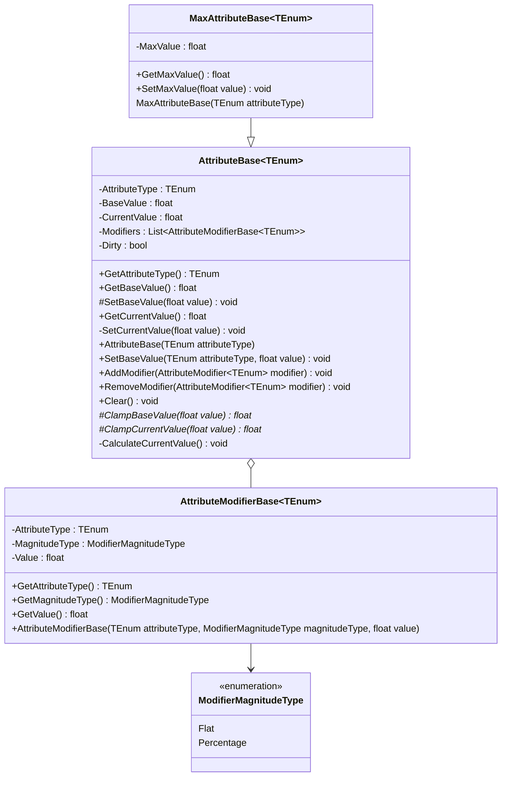

# Attribute

## 요구 사항

### AttributeBase

- 체력, 마나와 같은 특성과 공격력, 방어력과 같은 스탯 시스템에 사용됩니다.
  - Enum 을 타입 매개 변수로 사용하는 제네릭 클래스입니다.
  - 특성과 스탯은 별도의 클래스로 관리합니다.
- 동일한 Attribute 만 연산이 가능합니다.
  - Enum 값을 비교하여 동일한 Attribute 여부를 확인합니다.
- Value
  - Base: 기본값으로 사용되며 영구적으로 지속됩니다.
  - Current: Modifier 에 의해 일시적으로 적용되는 값입니다.
  - 0 <= Base / Current
- Modifier 는 장비 탈부착 및 버프 등에 의해 추가 혹은 제거됩니다.

### MaxAttributeBase

- 특성 혹은 스탯의 최댓값이 존재하는 경우 AttributeBase 대신 사용합니다.
- Value
  - Max: Base / Current 값의 최대 범위를 제한하며 값이 수정되도 Base / Max 비율을 유지합니다.
  - 1 <= Max
  - 0 <= Base / Current <= Max

## 클래스 다이어그램

