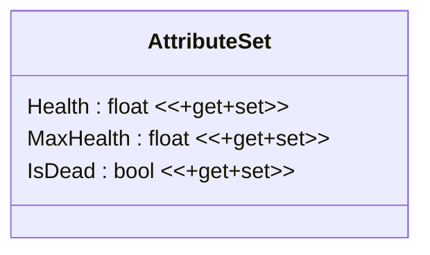

# AttributeSet

## 요구 사항

### MaxHealth

- 1 ≤ MaxHealth

### Health

- `IsDead == true` 상태에서 Health 값 변경 불가
- 0 ≤ Health ≤ MaxHealth
- MaxHealth 값 변경 시 Health / MaxHealth 비율을 유지하도록 Health 값 변경

### IsDead

- IsDead = true 설정 시 Health = 0
- IsDead = false 설정 시 Health = 1

> 부활 체력 설정은 외부 클래스에서 진행

## 클래스 다이어그램

