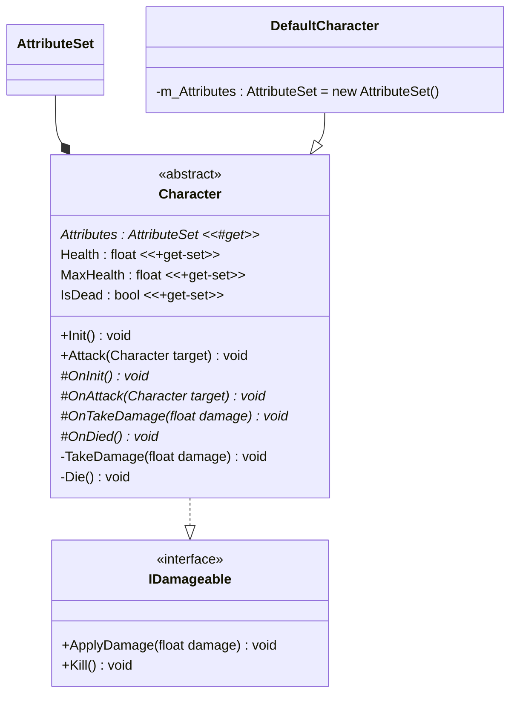

# Character

## 요구 사항

- AttributeSet 을 가지고 있다.
  - 클래스에 따라 고유의 AttributeSet 사용 (마나, 기력 등)
  - 스탯을 가지고 있다. (공격력, 방어력 등)
- 데미지를 주고 받을 수 있다.
  - 죽은 상태에서는 불가능합니다.
  - Attack(Character target)
  - TakeDamage(float damage)
- 애니메이션을 사용한다.

## 클래스 다이어그램

